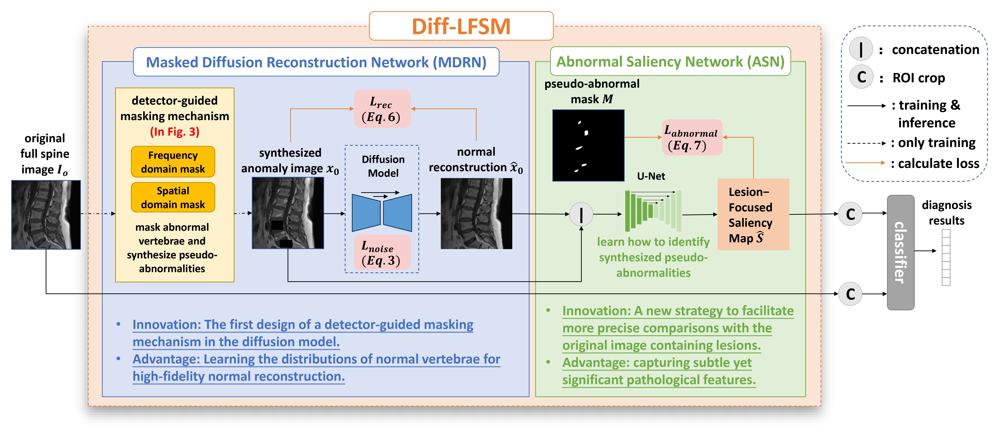

# Learning Interpretable Lesion-Focused Saliency Maps with Context-Aware Diffusion Model for Vertebral Disease Diagnosis

## Overview



## Environment and Data Preparation

To set up the environment, use the `requirements.txt` file to prepare the Conda environment. Ensure you have all necessary dependencies installed.

```
conda env create -f environment.yml
conda activate diff-lfsm
```

As an example, to prepare the VerTumor600 dataset, convert the MRI vertebrae data from JSON to PNG format using the provided script:

```
python ./data/VerTumor600/MRI_vertebrae/json_to_png.py
```

## Training and Testing

### 1. Train Diff-LFSM

To train the Diff-LFSM model, run the following command:

```
python diff_training_seg_training.py ARG_NUM=1
```

### 2. Generate LFSM using the Trained Model

Once the Diff-LFSM model is trained, use it to generate the Lesion-Focused Saliency Maps (LFSM):

```
python diff_training_seg_training.py ARG_NUM=2
```

### 3. Crop Individual Vertebrae

After generating LFSMs, crop out individual vertebrae from the images. For the VerTumor600 dataset, use the script below:

```
python ./data/VerTumor600/cropped_vertebrae/crop_images.py
```

### 4. Train and Test the Classifier

```
python spine_trans_cls_with_FE.py ARG_NUM=3
```

## Acknowledgement
Thanks to the following works: [AnoDDPM](https://github.com/Julian-Wyatt/AnoDDPM), [guided-diffusion](https://github.com/openai/guided-diffusion).

